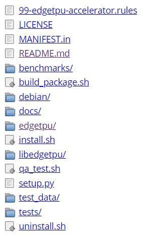
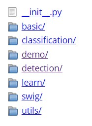

Coral Dev Board - Edge TPU
========================

This Readme is your guide to get started if you have your Coal Dev Board booting with Mendel image. The setup requires flashing the `Mendel Linux system` image to the board and then accessing the board's terminal. Once you have terminal access, you can begin running `TensorFlow Lite models`, in our case, we have helmet detection tflite model to realize inferences processes and get detections of helmet throw an image.

In that case, you have installed Mendel Linux System in your Coral Dev Board, so we can start to explain the configuration and the structure of the project. If you want to learn more about the Dev Board hardware, see the [datasheet](https://coral.withgoogle.com/docs/dev-board/datasheet/) or flashing process come to [MDT flash](https://coral.withgoogle.com/docs/dev-board/get-started/#flash-the-board).

## Requirements
`Note:` Do not power the board or connect any cables until instructed to do so.

Before you begin, collect the following hardware:

1. Linux or Mac computer (referred to below as "host computer").
2. USB-A to USB-microB cable (to connect your PC to the board's serial port).
3. USB-A to USB-C cable (to connect your PC to the board's data port).
4. 2 - 3A (5V) USB Type-C power supply (such as a phone charger).
5. Ethernet cable or Wi-Fi connection, in case of need.

## Getting Started
To get started you only need to follow the next steps:

1. Power the board - Plug in your 2 - 3A power cable to the USB-C port labeled.
2. Plug your HDMI cable to the HDMI port labeled.
3. Vizualize the Mendel Linux System Interface on your screen to interact with them.

When we finished with the steps above and we see the Mendel interface in our monitor, we can continue with the execution of the helmet detection project.

### Run a model on the Edge TPU
To run a model on edge TPU, in that case in Coral Dev Board, we initially download the EdgeTPU source repository of Google Coral Source, the project structure is like this:



In that case, you have the same code like Google Coral Sources in this repository + pretrained models for TPU.

When you init a new command prompt, you will see two directories in Mendel user:

```bash
ls -l
-- Coral-Dev/
    -- python-tflite-source/
-- Local-Dev/
```

Enter in python-tflite-source directory:
```bash
cd python-tflite-source/
```

Then we have to execute install.sh (notice that sudo permissions are not required)

```bash
bash ./install.sh
```

The install.sh scripts assumes you’re using Python 3.5, so if you’re not, you’ll want to open up the install.sh script,
scroll down to the final line of the file (i.e., the setup.py) where you’ll see this line:

```bash
python3.5 setup.py develop --user
```

Now you should see the same structure that image above.
We have to be in edgetpu folder.

```bash
cd edgetpu/
```



Finally here, we can execute our prediction command that we will explain in the next topic:

```bash
sudo python3 demo/object_detection.py
    --model model/.tflite
    --label model/label.txt
    --input model/image.jpg
```

`Note:` To see the result image, you can visualize it with `feh` package.

```bash
sudo apt-get install feh
```

Visualize image:

```bash
feh object_detection_result.jpg
```

`Caution:` When you're done, do not simply unplug the Dev Board. Doing so could corrupt the system image if any write operations are in progress. Instead, safely shutdown the system with the following command:

```bash
sudo shutdown now
```

When the red LED on the Dev Board turns off, you can unplug the power.

### Edge TPU Python API
The demo we have performs an inference on image using the Edge TPU Python library (the edgetpu Python module) [Python API Overview](https://coral.withgoogle.com/docs/edgetpu/api-intro/#api-overview). This library includes APIs that make it easy to perform an image classification or object detection inference. So we've created a sample code to show how you can use these APIs.

The Edge TPU Python library (the edgetpu module) makes it easy to perform an inference with TensorFlow Lite models on an Edge TPU device. It provides simple APIs that perform image classification, object detection, and weight imprinting (transfer-learning) on your device. If you're using the Dev Board or SoM, this library is included in the Mendel system image. If you're using an accessory device such as the USB Accelerator, you must install the library onto the host computer—only Debian-based operating systems are currently supported such as, Raspberry Pi.

### Code used
If you go to `python-tflite-source/edgetpu/demo/object_detection.py`, you should visualize the code of the object_detection engine. This script need the next params:

- Path to model (`Required`)
- Path to label.txt (If you want to see the label prediction)
- Path to the input image (`Required`)
- Path to the output image (If you want to save the detection predicted)

1. This script use from Python API for TPU an object of [DetectionEngine](https://coral.withgoogle.com/docs/reference/edgetpu.detection.engine/).
2. Open the image from path and with the following function named [DetectionEngine.DetectWithImage()](https://coral.withgoogle.com/docs/reference/edgetpu.detection.engine/#edgetpu.detection.engine.DetectionEngine.DetectWithImage) we'll do the inference.
3. After that we catch the result of the detection engine and print the labels, if exist in params, get boundig boxes predicted and the matching or prediction class.

Local execution of Tensorflow Object Detection API models
=======================

## Getting Started

### Run a model .pb on local env

```bash
ls -l
-- Coral-Dev/
-- Local-Dev/
```
Enter in Local-Dev directory and create the environment:
```bash
cd Local-Dev/
conda env create --file env.dev.yml
activate coral-edge-tpu
```

Create the object_detection library:
```bash
cd research/
python setup.py develop --user
```

Enter in object detection directory:
```bash
cd object_detection/
```

Finally here, we can execute our prediction command that we will explain in the next topic:

```bash
python Object_detction_image.py
```

### Code used

The script needs some variables to execute well, sush as:

- `MODEL_NAME`: Name of the directory containing the object detection module we're using
- `IMAGE_NAME`: Name of image file
- `CWD_PATH`: Grab path to current working directory
- `PATH_TO_CKPT`: Path to frozen detection graph .pb file, which contains the model that is used for object detection.
- `PATH_TO_LABELS`: Path to label map file
- `PATH_TO_IMAGE`: Path to image
- `NUM_CLASSES` = Number of classes the object detector can identify

#### Load the label map

```python
label_map = label_map_util.load_labelmap(PATH_TO_LABELS)
```

#### Label maps map indices to category names
So that when our convolution network predicts `5`, we know that this corresponds to `None`.
Here we use internal utility functions, but anything that returns a
dictionary mapping integers to appropriate string labels would be fine

```python
categories = label_map_util.convert_label_map_to_categories(label_map, max_num_classes=NUM_CLASSES, use_display_name=True)
category_index = label_map_util.create_category_index(categories)
```

#### Load the Tensorflow model into memory.

```python
detection_graph = tf.Graph()
with detection_graph.as_default():
    od_graph_def = tf.GraphDef()
    with tf.gfile.GFile(PATH_TO_CKPT, 'rb') as fid:
        serialized_graph = fid.read()
        od_graph_def.ParseFromString(serialized_graph)
        tf.import_graph_def(od_graph_def, name='')

    sess = tf.Session(graph=detection_graph)
```

#### Define input and output tensors (i.e. data) for the object detection classifier
Output tensors are the detection boxes, scores, and classes
Each box represents a part of the image where a particular object was detected
Each score represents level of confidence for each of the objects.
The score is shown on the result image, together with the class label.

```python
image_tensor = detection_graph.get_tensor_by_name('image_tensor:0')
detection_boxes = detection_graph.get_tensor_by_name('detection_boxes:0')
detection_scores = detection_graph.get_tensor_by_name('detection_scores:0')
detection_classes = detection_graph.get_tensor_by_name('detection_classes:0')
```

#### Number of objects detected

```python
num_detections = detection_graph.get_tensor_by_name('num_detections:0')
```

#### Load image using OpenCV.
We expand image dimensions to have shape: [1, None, None, 3]
i.e. a single-column array, where each item in the column has the pixel RGB value.

```python
image = cv2.imread(PATH_TO_IMAGE)
image_expanded = np.expand_dims(image, axis=0)
```

#### Perform the actual detection by running the model with the image as input

```python
(boxes, scores, classes, num) = sess.run(
    [detection_boxes, detection_scores, detection_classes, num_detections],
    feed_dict={image_tensor: image_expanded})
```

#### Draw the results of the detection

``` python
vis_util.visualize_boxes_and_labels_on_image_array(
    image,
    np.squeeze(boxes),
    np.squeeze(classes).astype(np.int32),
    np.squeeze(scores),
    category_index,
    use_normalized_coordinates=True,
    line_thickness=8,
    min_score_thresh=0.60)

cv2.imshow('Object detector', image)
cv2.waitKey(0)
cv2.destroyAllWindows()
```